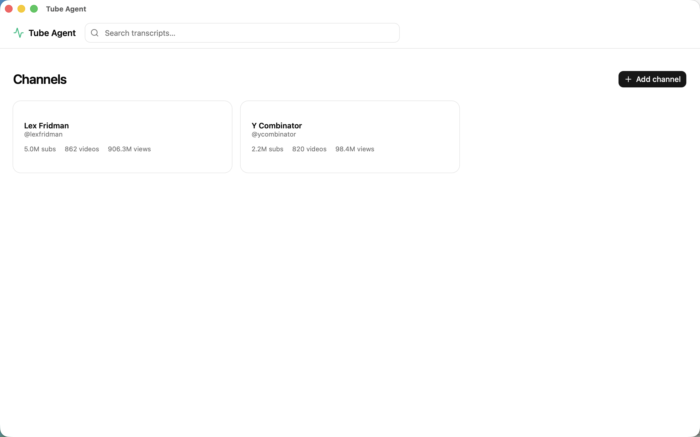
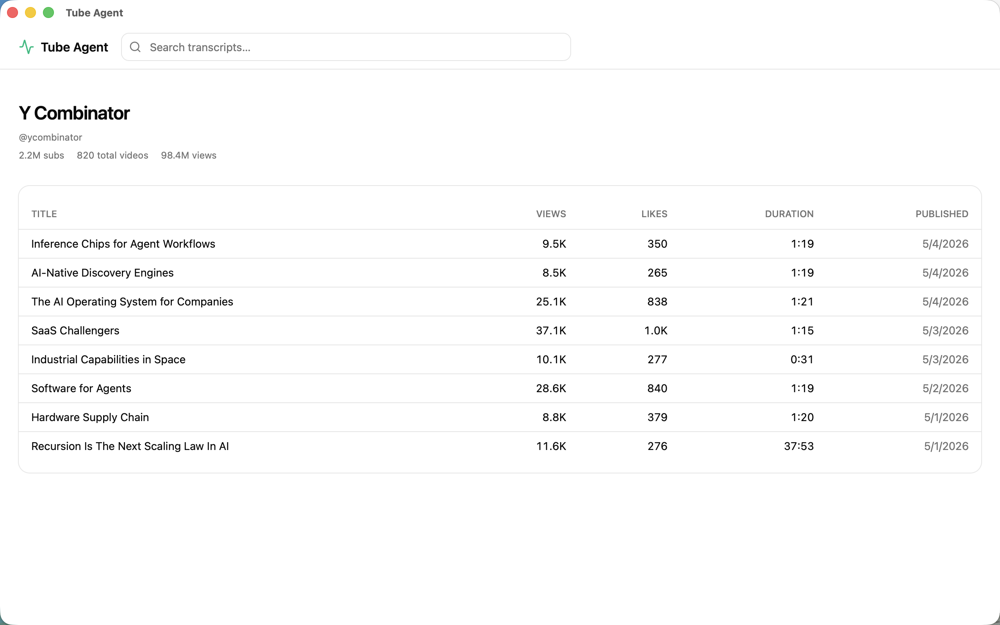

# Tube Agent

Local-first desktop app for indexing YouTube channel transcripts, searching them by keyword **or** semantic meaning, and generating English summaries/overviews from saved transcripts.

The whole stack runs locally: SQLite for storage, fastembed (ONNX) for embeddings, yt-dlp for transcript fetch. No cloud accounts, no auth, no recurring infrastructure cost.





## Setup

```bash
# 1. Python venv + install
python3 -m venv .venv
.venv/bin/pip install -e ".[dev]"

# 2. API keys
cp .env.example .env
# Required:
#   YOUTUBE_API_KEY=...   from Google Cloud Console
#   GEMINI_API_KEY=...    from Google AI Studio  (only needed for summaries / overviews)
```

The first run that touches semantic search downloads the embedding model (~220 MB) into the OS app data dir. Subsequent runs are instant.

## Two ways to use it

### A. Desktop app (Tauri, recommended)

Tauri 2 + React shell that spawns the Python core as a sidecar. See [`desktop/README.md`](desktop/README.md) for the full dev / release flow.

```bash
cd desktop
npm install
npm run tauri dev          # native window, sidecar spawned automatically
# or:
bash scripts/build.sh      # PyInstaller sidecar + Tauri bundle (.dmg)
```

### B. CLI + API (headless)

```bash
# index a channel (transcripts only by default — fast, low-quota)
.venv/bin/python -m scripts.fetch_all @channel_handle

# run the API server (semantic search + REST)
.venv/bin/tube-api --reload
```

Data lives in the OS app data directory by default:

| OS | Path |
|---|---|
| macOS | `~/Library/Application Support/tube-agent/` |
| Linux | `~/.local/share/tube-agent/` |
| Windows | `%APPDATA%\tube-agent\` |

Override with `APP_DATA_DIR=/some/path` in `.env`. Override the DB independently with `DATABASE_URL=sqlite:///./local.db` (or any SQLAlchemy URL).

---

## Pipeline: Step-by-Step

The default pipeline is **fast and free**: channel metadata + video list + transcript captions + on-device embeddings. Comments, Gemini summaries, and overviews are **opt-in** via flags or the desktop checkbox.

### Stage 1 — Channel metadata

`GET /youtube/v3/channels?forHandle={handle}` to fetch title, description, subscriber/view counts, and the uploads playlist ID.

**Quota: 1 unit.**

### Stage 2 — Video list

Pages `/youtube/v3/playlistItems` for the `--max-videos` newest uploads, then batches `/youtube/v3/videos` for full metadata (duration, view/like/comment counts, tags). Computes `durationSeconds`, `likeRatio`, `commentRatio`.

**Quota: ~1 unit per 50 items + 1 unit per details batch.**

### Stage 3 — Transcripts (default ON)

For each video:

1. Skip if a transcript for one of the requested languages already exists.
2. Use `yt-dlp` to enumerate caption tracks (manual + auto), pick the best language match in the priority list (`--transcript-languages`, default `ko,en`).
3. Download the caption file (json3 / srv3 / vtt) and parse into segments with `start_seconds` / `end_seconds` / `text`.
4. Merge adjacent segments up to ~520 chars per chunk for cleaner search hits.
5. Save to the DB.

Transcript fetch is **parallel** (`--workers`, default 5). Disable with `--skip-transcripts`.

**No YouTube API quota cost** — yt-dlp uses the public YouTube site directly.

### Stage 4 — Embeddings (default ON, runs after Stage 3)

For each transcript segment that doesn't yet have an embedding for the configured model:

1. Pull text + segment id.
2. Run a local fastembed model (default `sentence-transformers/paraphrase-multilingual-MiniLM-L12-v2`, 384-dim, multilingual incl. Korean) in batches of 64.
3. Store the L2-normalised float32 vector as a BLOB keyed by `(segment_id, model_name)`.

Search later does in-memory cosine similarity in numpy — fast for tens of thousands of segments, no SQLite extension required.

Switch the embedding backend via `EMBEDDING_PROVIDER=gemini` + `EMBEDDING_MODEL=text-embedding-004`. Disable embedding entirely with `--skip-embeddings`.

### Stage 5 — Comments (opt-in via `--with-comments`)

`GET /youtube/v3/commentThreads` for top-level comments (max 100 per video, sorted by relevance). Comment authors are SHA-256-hashed before storage for privacy. **Quota: 1 unit per video.**

### Stage 6 — Gemini transcript summaries (opt-in via `--with-summaries`)

Uses the saved transcript text as Gemini input and returns structured JSON: intro, bullets with timestamps, sectioned outline, topics, content type, target audience, tone, mentions, notable paraphrases. Results are saved to the DB and can be opened from the desktop video detail page.

Desktop default is the latest 10 videos when the checkbox is enabled. CLI default is also 10 for transcript summaries. Use `--summary-mode video` to fall back to the older multimodal video analysis path.

### Stage 7 — Channel overview (runs after summaries unless `--skip-report`)

Aggregates channel metadata, video stats, and saved summaries, then asks Gemini to produce an English markdown overview: what the channel is about, recurring themes, recommended starting videos, and audience fit.

---

## Storage

| Backend | When Active |
|---------|-------------|
| `PostgresStorage` (SQLAlchemy ORM, despite the name works with SQLite or Postgres) | Default — uses `sqlite:///{APP_DATA_DIR}/tube_agent.db` unless `DATABASE_URL` is set explicitly |
| `LocalStorage` (JSON tree under `data/{handle}/`) | CLI fallback when `DATABASE_URL` is empty and not derivable; used by `tube-migrate` for importing legacy JSON |

The DB schema is created idempotently on first start — no migrations to run.

---

## CLI Options

```bash
.venv/bin/python -m scripts.fetch_all @channel_handle [OPTIONS]
```

| Option | Default | Description |
|--------|---------|-------------|
| `--max-videos N` | 100 | Newest N videos to fetch |
| `--with-comments` | off | Fetch top-level comments |
| `--with-summaries` | off | Generate Gemini transcript summaries |
| `--skip-transcripts` | off | Skip transcript fetch |
| `--skip-embeddings` | off | Skip on-device embedding generation |
| `--skip-report` | off | Skip Gemini report generation (only matters with `--with-summaries`) |
| `--transcript-languages` | `ko,en` | Comma-separated language priority |
| `--summary-max N` | 10 | Cap how many latest videos get summarized |
| `--summary-mode` | `transcript` | `transcript` summary or older `video` multimodal analysis |
| `--summary-language` | `en` | Summary output language for transcript summaries |
| `--media-resolution` | `low` | Gemini frame sampling: `low` / `medium` / `high` |
| `--workers N` | 5 | Parallel workers for transcript + summary stages |

### Examples

```bash
# Default: latest 20 videos, transcripts + embeddings only (no Gemini)
.venv/bin/python -m scripts.fetch_all @eo_korea --max-videos 20

# Add English transcript summaries for the latest 10 videos
.venv/bin/python -m scripts.fetch_all @eo_korea \
  --max-videos 20 --with-summaries --summary-max 10

# Full pass with comments + summaries
.venv/bin/python -m scripts.fetch_all @eo_korea \
  --with-comments --with-summaries --summary-max 50
```

---

## API Server Mode

```bash
.venv/bin/tube-api --reload
```

In-process FastAPI with `BackgroundTasks` — no Celery, no Redis, single binary. Embedding model warms in the background on startup so the first semantic search isn't blocked on a 220 MB download.

### Endpoints

| Method | Path | Description |
|--------|------|-------------|
| POST | `/api/v1/channels` | Start channel analysis pipeline (runs in background) |
| GET | `/api/v1/channels` | List channels |
| GET | `/api/v1/channels/{handle}` | Channel details |
| GET | `/api/v1/channels/{handle}/videos` | Video list (sort/filter/paginate) |
| GET | `/api/v1/channels/{handle}/videos/{id}/summary` | Video summary |
| POST | `/api/v1/channels/{handle}/videos/{id}/summary` | Generate transcript summary |
| GET | `/api/v1/channels/{handle}/videos/{id}/transcript` | Timestamped transcript |
| GET | `/api/v1/channels/{handle}/reports` | List reports |
| GET | `/api/v1/channels/{handle}/reports/{type}` | Get report |
| POST | `/api/v1/channels/{handle}/reports/channel_overview` | Generate channel overview |
| GET | `/api/v1/search?q=...` | Keyword search across videos / summaries / transcripts (ILIKE) |
| GET | `/api/v1/search/semantic?q=...&channel=...` | Semantic transcript search (cosine over embeddings) |
| GET | `/api/v1/system/embedding-status` | Embedding model warmup state |
| POST | `/api/v1/system/embedding/prepare` | Re-trigger warmup after a failure |
| GET | `/api/v1/jobs/{id}` | Job status |
| GET | `/health` | Health check |

---

## Claude Code Integration

Skills and agents are available in Claude Code:

```
/channel-analyze @channel_handle    Collect data + run 4 analysis agents in parallel
/summarize-videos @channel_handle   Run Gemini video analysis only
/channel-report                     Generate a comprehensive English report from analysis results
```

---

## Project Structure

```
scripts/
  fetch_all.py            CLI orchestrator (entry point)

tube_agent/
  config.py               Settings + per-OS app data dir resolution
  cli.py                  tube-api server entry point
  cli_sidecar.py          Tauri sidecar entry (uvicorn programmatic runner)
  services/
    youtube.py            YouTube Data API v3 client (httpx)
    gemini.py             Gemini API client (multimodal video analysis)
    transcripts.py        yt-dlp caption extractor
    embeddings.py         EmbeddingProvider ABC + Fastembed (local) + Gemini providers
    pipeline.py           Pipeline orchestration (shared by CLI and API)
    report.py             Channel report generation
  storage/
    base.py               StorageBackend ABC (incl. embedding methods)
    local.py              JSON file storage
    postgres.py           SQLAlchemy ORM (SQLite or Postgres)
  api/                    FastAPI endpoints (BackgroundTasks-based)
    routes/system.py      Embedding warmup status + retry
  migrations/             JSON → DB importer (tube-migrate)

desktop/                  Tauri 2 + Vite + React 19 + shadcn (see desktop/README.md)
  src/                    React app (channels / search / video detail)
  src-tauri/              Rust shell (sidecar spawn + lifecycle)
  scripts/                build-sidecar.sh + build.sh

data/{handle}/            CLI JSON output (legacy / migration source)
  raw/, processed/

output/{handle}/          CLI report output (legacy / migration source)
  reports/
```

---

## Why this exists

I started this as a multi-tenant SaaS — Supabase, Celery, Cloudflare R2, Fly.io, the works — until it became hard to ignore that a hosted service that keeps scraped captions, comments, and AI summaries of other people's videos in a central database is sitting squarely on top of YouTube's "30-day cache only" rule for API data and yt-dlp's "automated means" prohibition. The legal risk surface for a *hosted* product is real; the risk surface for a tool that each user runs on their own machine, indexing their own selection of channels with their own API key, is roughly the same as yt-dlp itself.

So this is the pivot: same Python core, but every install is its own copy. The SQLite DB lives in your OS app data dir, the embeddings live next to it, the YouTube key is yours. There's no central server to send a takedown to.

A few non-obvious technical decisions that came out of that constraint:

- **Embeddings via fastembed (ONNX), not sentence-transformers.** ONNX-Runtime is ~80% smaller than the equivalent PyTorch stack, and the multilingual MiniLM model (`paraphrase-multilingual-MiniLM-L12-v2`, ~220 MB) does well on Korean and English transcripts in the same vector space. First-run download is from Hugging Face Hub — no API keys, no signup.
- **Vector search in numpy, not sqlite-vec.** Python's stdlib `sqlite3` ships without `enable_load_extension` on most distributions (pyenv, system Python on macOS), so `sqlite-vec` would have made the install instructions much messier. With L2-normalised float32 vectors stored as BLOBs, in-memory cosine via `matrix @ q` is fast enough for tens of thousands of segments. The "we'll switch to FAISS or sqlite-vec when the corpus blows past that" path stays open, but isn't day-one work.
- **Tauri 2 + Python sidecar over Electron.** The Rust shell is ~30 MB; the bundled FastAPI sidecar (PyInstaller `--onefile`, fastembed + onnxruntime + yt-dlp + uvicorn) lands at ~72 MB. Total install is well under what shipping its own Chromium would cost.
- **Sidecar over HTTP, not Tauri's stdio IPC.** Keeps FastAPI as-is (no protocol translation layer), unblocks `curl` + browser DevTools for debugging, and the random-port + Tauri command pattern stays firewall-friendly.
- **Process-group cleanup for the sidecar.** PyInstaller `--onefile` actually exec's a child Python interpreter under a small bootstrap; killing the bootstrap parent leaves the child as an orphan. Fix: spawn the sidecar with `cmd.process_group(0)` on Unix and send `SIGTERM` to the negative PID from Rust on `RunEvent::Exit` so the whole tree is reaped.

There's no monetisation plan — the only model that *would* monetise (captions in a central database) is exactly what this pivot rejects. The code is here so it isn't wasted, and so the trail of decisions is documented somewhere durable.

---

## License

MIT — see [LICENSE](LICENSE).
